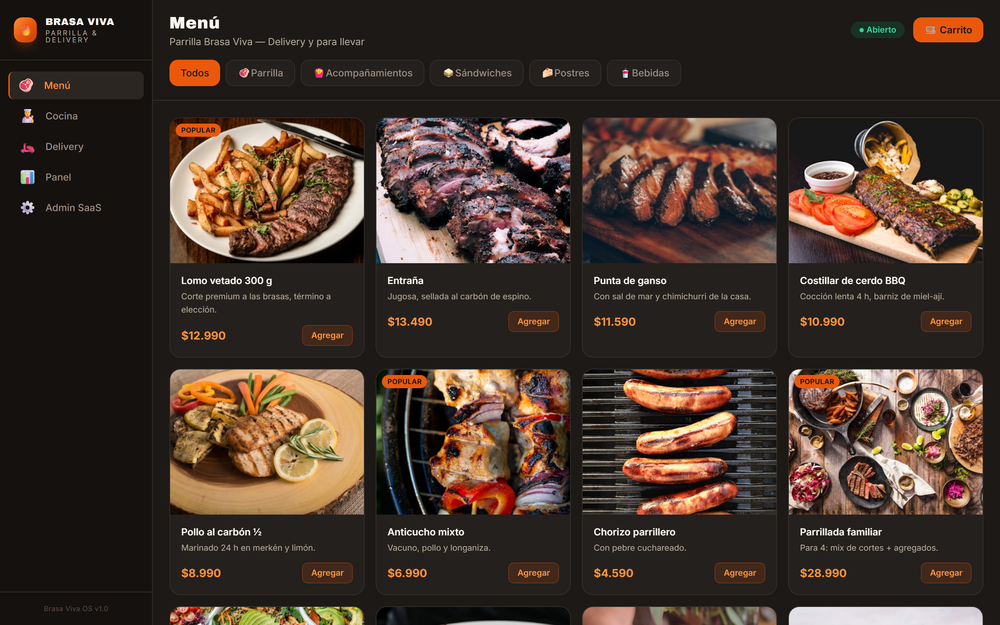
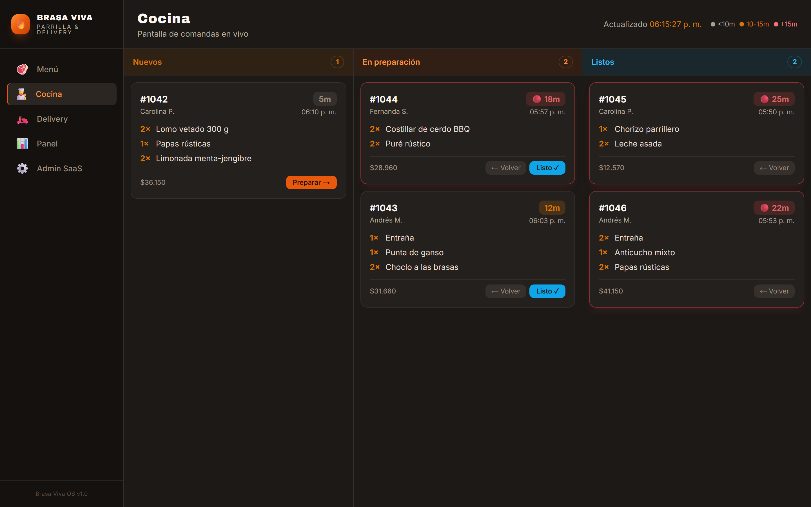
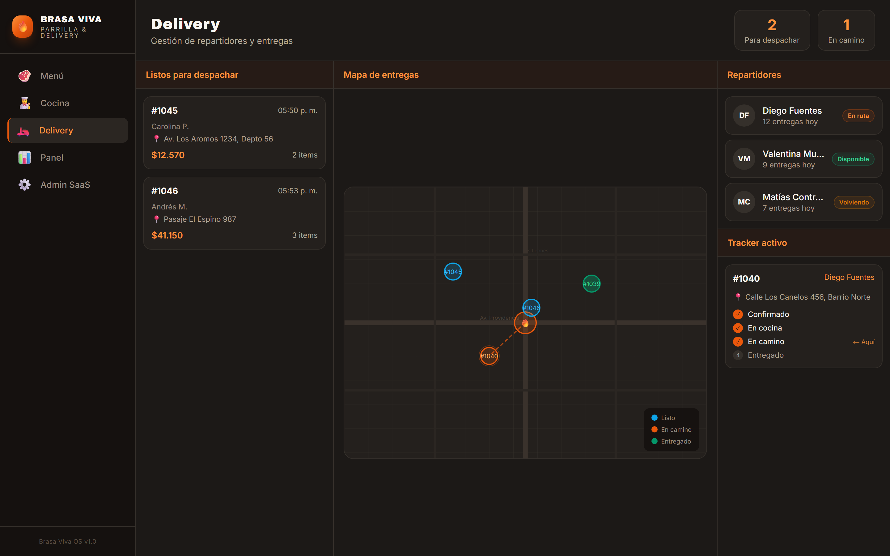
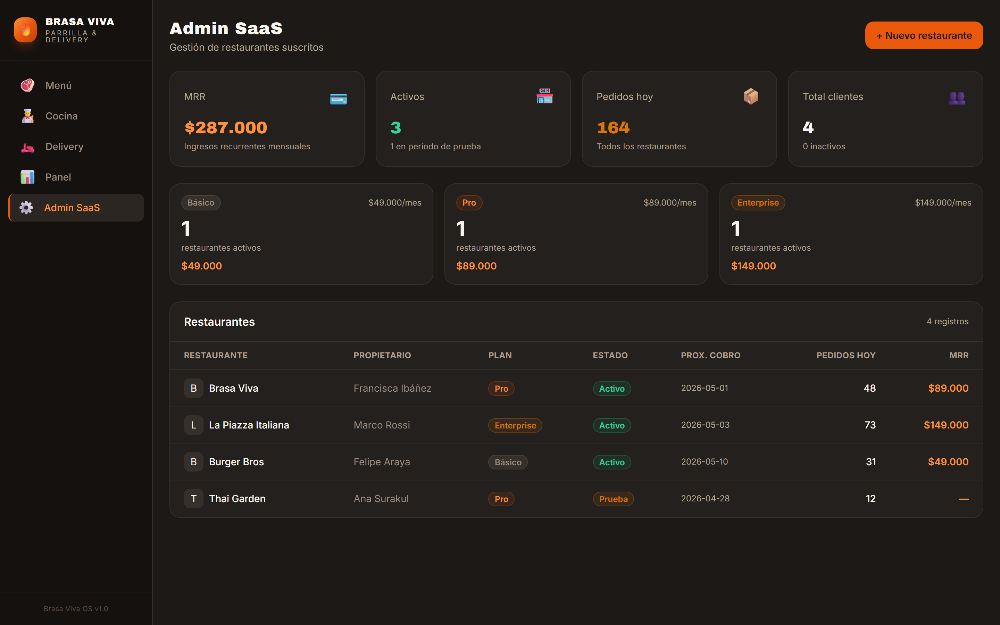
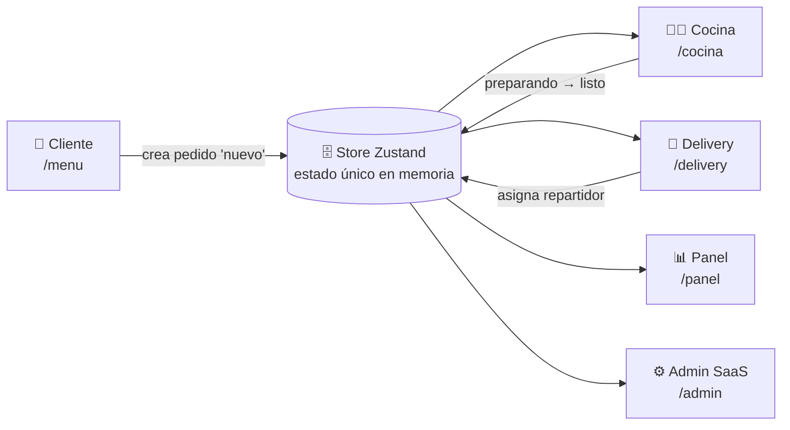
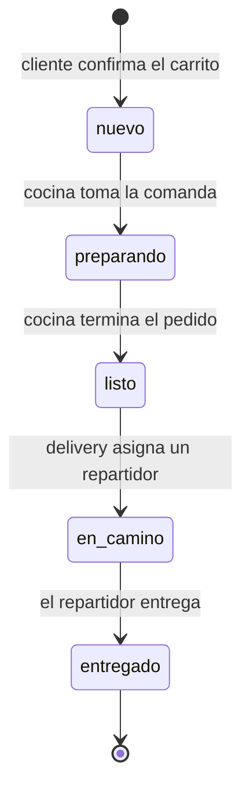

# 🔥 Brasa Viva — Sistema de pedidos y delivery multi-rol


Plataforma para una parrilla con delivery propio: el **cliente** pide, la **cocina**
prepara, el **repartidor** entrega y el **administrador** supervisa. Cuatro vistas
distintas, sincronizadas sobre una única máquina de estados en memoria — cuando un
pedido cambia de estado en la cocina, la pantalla de delivery lo ve al instante.

**Prototipo de producto · datos ficticios en memoria** · Next.js 14 · TypeScript · Zustand · Tailwind CSS · Vitest

> ⚠️ **Es una demo autocontenida.** No hay backend, base de datos ni pagos reales:
> el catálogo, los pedidos y los repartidores son datos de demostración que viven en
> el estado del cliente y se reinician al recargar. El foco está en el modelo de dominio,
> la sincronización entre roles y el diseño de interfaz, no en la persistencia.

---

## Por qué existe

En un restaurante con reparto propio, el punto de dolor no es cocinar: es **coordinar**.
Un pedido pasa por manos de tres personas distintas (quien lo toma, quien lo prepara y
quien lo lleva) y cada una necesita ver lo mismo actualizado en tiempo real. Sin un
sistema, esa coordinación vive en gritos, papelitos y grupos de WhatsApp.

Brasa Viva modela ese flujo como **una sola fuente de verdad**: un pedido es una entidad
con un ciclo de vida explícito, y cada rol es una vista sobre ese mismo estado. Es un
prototipo —los datos son ficticios— pero la arquitectura es la que usaría un producto real.

## Vistas

| Cliente · `/menu` | Cocina · `/cocina` |
|---|---|
|  |  |
| Catálogo por categorías, carrito y checkout que **crea el pedido**. | Tablero de comandas en vivo con semáforo de tiempos (verde / ámbar / rojo). |

| Delivery · `/delivery` | Admin SaaS · `/admin` |
|---|---|
|  |  |
| Cola de despacho, mapa de entregas y asignación de repartidor con tracker. | Vista de negocio: restaurantes suscritos, planes y MRR (capa SaaS). |

> También existe una vista **`/panel`** (dashboard operativo: ingresos del día, ticket
> promedio, ventas por hora, top de productos y estado de los pedidos) construida sobre
> el mismo store.

## Arquitectura

Un único store de Zustand concentra todo el estado del dominio (carrito, pedidos,
repartidores y el flag de "abierto/cerrado"). Las cuatro vistas **leen y escriben sobre
ese mismo store**, sin capa intermedia: por eso quedan sincronizadas de forma natural.



El corazón del dominio es el **ciclo de vida del pedido**, una máquina de estados de
cinco pasos:



Cómo se disparan esas transiciones en la app real:

- **`nuevo → preparando → listo`** las controla la **Cocina**, con los botones
  _Preparar_ / _Listo_ (y _Volver_), a través de `updateOrderStatus`.
- **`listo → en_camino`** la dispara el **Delivery** vía `assignDriver`, que además marca
  al repartidor como `en_ruta` en la misma operación atómica.
- **`entregado`** cierra el ciclo: es el estado de los pedidos históricos y el que alimenta
  las métricas del `/panel`; queda cubierto por los tests del store.

## Ejecutar

```bash
npm install
npm run dev    # http://localhost:3000  (redirige a /menu)
npm test       # 8 tests del store (Vitest)
```

## Decisiones técnicas

- **Zustand como fuente de verdad única.** Elegí Zustand por encima de Redux (mucho
  boilerplate para el tamaño del proyecto) y de Context (re-renders difíciles de acotar
  y sin selectores). Con un solo hook `useStore`, las cuatro vistas comparten
  exactamente el mismo estado y se mantienen en sincronía sin prop-drilling ni capas
  intermedias.

- **Pedido como máquina de estados explícita.** El estado del pedido es un tipo cerrado
  (`'nuevo' | 'preparando' | 'listo' | 'en_camino' | 'entregado'`), no un booleano ni un
  string libre. Modelar el ciclo de vida como una máquina de estados hace que cada vista
  sea, literalmente, una proyección de un mismo estado: la Cocina filtra `nuevo/preparando/listo`,
  el Delivery filtra `listo` (por despachar) y `en_camino` (en tracker).

- **Transiciones centralizadas en el store; reglas de negocio en la UI.**
  Las transiciones viven en el store como acciones puras (`updateOrderStatus`,
  `assignDriver`, `updateDriverStatus`). Las **guardas de negocio**, en cambio, viven hoy
  en la capa de UI: es la vista de Delivery la que solo ofrece para despachar los pedidos
  en estado `listo` (`readyOrders`) y solo permite elegir repartidores `disponible` o
  `volviendo` en el selector.

  **El trade-off (honesto):** el store es un reductor "tonto" que confía en quien lo llama.
  A favor: máxima simplicidad y un estado compartido sin fricción. En contra: las
  invariantes del dominio no están garantizadas a nivel de dominio — si alguien llama
  `assignDriver` sobre un pedido que no está `listo`, el store lo dejará pasar igual.
  Eso está **documentado a propósito por un test** (ver abajo). En una evolución a
  producto real, esas guardas subirían al store (o a una capa de dominio / servidor) para
  que la regla no dependa de que cada pantalla se acuerde de aplicarla.

- **Datos en memoria por diseño.** El catálogo, los pedidos y los repartidores son mocks
  (`src/lib/mockData.ts`). Como el store aísla el acceso a esos datos, migrar a una API o
  base de datos real significaría cambiar las acciones del store, no las vistas. Las
  imágenes de los platos se sirven desde Unsplash.

## Tests

`npm test` corre **8 tests de Vitest** sobre el store (`src/__tests__/store.test.ts`), que
documentan el comportamiento del dominio más que perseguir cobertura:

- **Ciclo de vida del pedido** — recorre `nuevo → preparando → listo → en_camino → entregado`
  y deja explícito que el paso `listo → en_camino` ocurre vía `assignDriver`, no vía
  `updateOrderStatus`; y que un pedido nuevo se antepone a la lista (el más reciente primero).
- **Asignación de repartidor** — al asignar un repartidor `disponible` a un pedido `listo`,
  el pedido pasa a `en_camino` y el repartidor a `en_ruta`; la operación no toca a otros
  pedidos ni repartidores; y **un test deja constancia de que el store no valida el estado
  previo** (esa regla vive en la UI de Delivery) — el trade-off descrito arriba, fijado en código.
- **Otras reglas del store** — `toggleOpen` (abierto/cerrado del local),
  `incrementOrderCounter` (correlativo de pedidos) y `updateDriverStatus` (estado de un
  repartidor de forma independiente).

## Identidad

Paleta cálida de parrilla — brasa (naranja), carbón (fondo oscuro) y crema — con
tipografía **Archivo Black** para titulares e **Inter** para el cuerpo. Todo con contraste
AA en los textos y badges de estado.

## Licencia

[MIT](LICENSE) © 2026 Alberto Chávez
